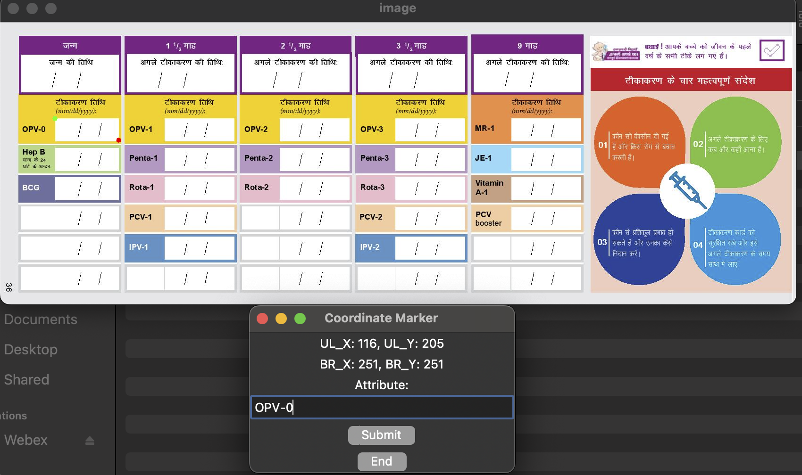

# Digitization-of-MCP-Cards

<<<<<<< HEAD
This repository contains the code for the ACM JCSS paper: ["Robust OCR Pipeline for Digitization of Mother and Child Protection Cards in India"](https://dl.acm.org/doi/10.1145/3608114), to be published in ACM JCSS 2023.

> The dataset can be accessed [here](https://csciitd-my.sharepoint.com/:f:/g/personal/csy207655_iitd_ac_in/EvwtbNm-my9KpB7uQ3EQ9dEBtzUhPskOqxSIAQVFwPhxsQ?e=h4ZgNn).

## Data Description

1. The dataset consists of MCP card images as shown below.
2. Each MCP card contains 28 fields where handwritten dates are filled.
3. These files can be accessed in the `Card_Images` folder:
   - Cards used for training: `training_images`
   - Cards used for testing: `test_images`
4. Coordinates for ROIs are in `templateCoordinates.csv`.
5. Cropped date images are in `Cropped_ROIs`:
   - Train & Test
   - Annotation is available in `gt.txt` file.
6. LMDB datasets of Cropped dates are in the `LMDB_Data` folder.

## Installation
### Requirements:
```python
   conda create -n mcp python==3.9.17
   pip install -r requirements.txt
```
### Install:
```python
   conda create --name mcp
   conda activate mcp
   pip install -r requirements.txt
```
## Global-Local Homography based Image Alignment and Text Localization

### Requirements
1. Template image (unfilled form).
2. Bounding-box coordinates and ROI name/id.

For changing the paths, go to Text Localization folder and modify `local_variables.py` as instructed.

### How to get the ROIs?
If you want to get the text ROIs for you specific Form type, you can follow the instructions below. </br>
Note that for the MCP cards the ROIs are already provided in the ROI_info/templateCoordinates.csv folder.



1. Run `python mark_rois.py`.
2. Mark Upper_left and Bottom_right coordinates.
3. Type attribute name and Click submit.
4. Mark more regions if needed or Click end.
5. File saved at `ROI_info/rois.csv`. Update `local_variables.py` accordingly.

### How to get Local Regions?
If you want to get the coordinates for the local regions, follow the instructions below.<span style="color: green;">(Read paper for details on Global-Local alignment)</span></br>
Note that for the MCP cards the ROIs are already provided in the ROI_info/templateCoordinates.csv folder.


1. Run `python mark_local_regions.py`.
2. Mark coordinates, Click submit.
3. Mark more regions if needed or click end.
4. File saved at `ROI_info/{template_name}_local_regions.csv`.

### Global Alignment

Run `python align_global.py`.

Results saved in `output`:
1. Aligned Images: `output/{template_name}__globally_aligned_images/{img_name}.jpg`
2. Extracted ROIs: `output/{template_name}__globally_aligned_rois/{img_name}_{attribute_name}.jpg`
3. Homography Matrices: `output/{template_name}__global_alignment_mat/{img_name}.pkl`

### Local Alignment

Run `python align_local.py`.

Results saved in `output`:
1. Local alignment w.r.t. `local_regions` mentioned in `local_variables.py`.
2. Multiple ROIs are saved w.r.t each local homography.
3. All ROIs and homography matrices names are prepended by `local_homography_number`.

All local ROIs go through OCR and highest-confidence prediction is chosen. </br>You can skip the local homography part and directly run OCR on the ROIs extracted through global alignment. 

## Instructions for Performing OCR

The OCR code is largely motivated from the Repo: [Link](https://github.com/clovaai/deep-text-recognition-benchmark/) 

The pretrained_weights can be accessed from here: [Link](https://drive.google.com/drive/folders/1Fx8-RrfpuE60lObv3D4BVde9UlVAx_Ry?usp=sharing)

### Dataset format
1. A folder containing images of the cropped text (dates in our case)
2. a text file containing absolute path of the image and annotation (space separated)

#### Create LMDB files
The code requires the dataset to be in the LMDB format. The instructions for creating LMDB files are as follows:
```python
cd OCR
python3 create_lmdb_dataset.py --gtFile "{gt_file_path.txt}" --outputPath "{output_folder_path}
```
This will create the lmdb files in the given folder, and a pickleDict folder to save the path information of the images in pickle file.</br>
You can repeat the same for creating train, test and validation files. 

## Training
The code requires the dataset to be in the LMDB format. The instructions for creating LMDB files are as follows:
```python
CUDA_VISIBLE_DEVICES=0 python3 train.py \
   --train_data "train_lmdb_folder_path" \
   --valid_data "val_lmdb_folder_path"  \
   --exp_name "xyz" --batch_size 192 --Transformation None\
   --FeatureExtraction ResNet --SequenceModeling BiLSTM \
   --Prediction Attn --num_iter 10000 --rgb 
```

## Testing
The code requires the dataset in the LMDB format. The instructions for creating LMDB files are as follows:
```python
CUDA_VISIBLE_DEVICES=0 python3 test.py \
   --eval_data "test_lmdb_folder_path" \
   --Transformation None --FeatureExtraction ResNet \
   --SequenceModeling BiLSTM --Prediction Attn \
   --saved_model ./saved_models/xyz/best_accuracy.pth \
   --rgb --output_file resnet_bilstm.txt
```

## Testing ROIs with Local Homography
1. Create LMDB dataset for the local files
2. Note that, there will be multiple files for the same ROI
2. Based on the unique image_name get the ground_truth from original gt file


```python
CUDA_VISIBLE_DEVICES=0 python3 test.py \
   --eval_data "test_local_lmdb_folder_path" \
   --Transformation None --FeatureExtraction ResNet \
   --SequenceModeling BiLSTM --Prediction Attn \
   --saved_model ./saved_models/xyz/best_accuracy.pth \
   --rgb --output_file resnet_bilstm_local.txt
```

Run postprocess.py file:
```python
python postprocess.py --path TextResults/resnet_bilstm_local.txt
```
This will pick the predictions with the highest confidence and save the output in the TextResults/resnet_bilstm_local_processed.txt file

Run get_date_accuracy.py file:
```python
python get_date_acc.py --path TextResults/resnet_bilstm_local_processed.txt
```

=======
This repo contains the code for the paper "Robust OCR Pipeline for Digitization of Mother and Child Protection Cards in India" to be published in ACM JCSS 2023.


The dataset can be accessed here: [Link](https://csciitd-my.sharepoint.com/:f:/g/personal/csy207655_iitd_ac_in/EvwtbNm-my9KpB7uQ3EQ9dEBtzUhPskOqxSIAQVFwPhxsQ?e=h4ZgNn)
>>>>>>> e045945449da31102c348edeb2e4ff494a9612bf

